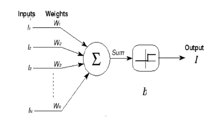
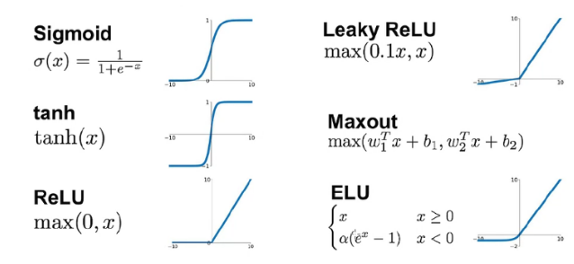
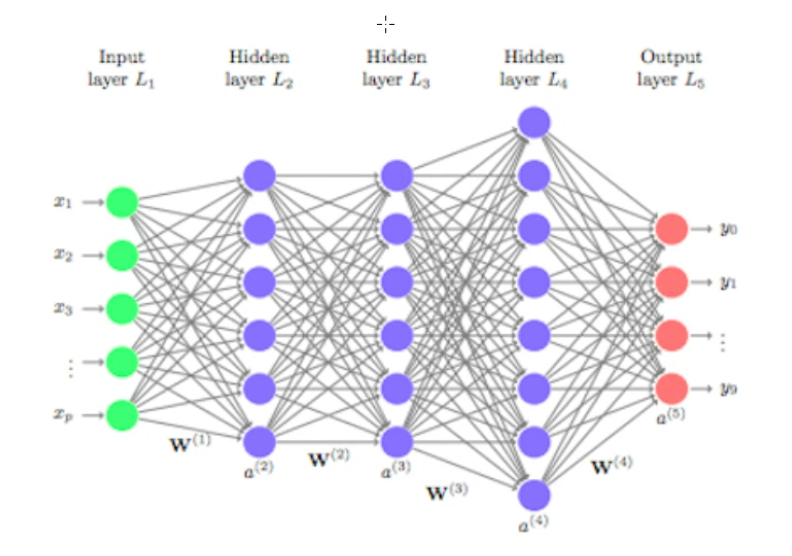

# Redes Neuronales - 2024

## Clase #2

La nerona de McCulloch y Pitts (1943)

La neurona toma como inputs las salidas de algunas de las neuronas de la capa anterior, todas ponderadas con algun peso asignado. Luego, esta realiza la suma de cada entrada ponderada con su peso. Y evalua una **funcion de activación** para decidir la salida de la neurona. 

donde 

- $W_i$ es el peso que se le da a la eficacia de esa conexion neuronal

- $I_i$ : señal que proviene de la neurona i

- $b$ : umbral con el que se activara la neurona

- $I$ : Salida de la neurona (1 o 0, para esta funcion de activación por umbral)

$sum = h_i = \sum_{i=1}^N{W_i I_i}$ y si $h_i$ es mayor o menor que el umbral, la neurona se activara o no se activara. 

Diferentes funciones de activación **continuas**

Las redes neuronales se miden con el numero de capas (desde la siguiente a la entrada hasta la salida)

Red neuronal **feed-forward**

Es uno de los primeros modelo de red neuronales propuesto, en este diseño las neuronas solo pueden conectar sus salidas con las entradas de neuronas que esten en capas siguientes.

## Clase #3

### Sistemas dinámicos
Un sistema dinámico es cualquier sistema físico cuyo estado evoluciona con el tiempo, nos permiten modelar y ganar capacidad preventiva e la neurociencia teórica y computacional. 

- Sistemas dinámicos continuos: las variables que describen el estado del sistema toman valores continuos y sus razones de cambio se rigen por ecuaciones diferenciales ordinarias
![[Pasted image 20240826110533.png]]
- Sistemas dinámicos discretos: las variables que describen el estado son relaciones de recurrencia. La variable independiente de tiempo es discreta. Las variables del estado del sistema pueden ser discretas o continuas. 

Nos vamos a concentrar en **Sistemas dinámicos continuos**

Existen sistemas que estan descriptos por una única variable continua **x**. Que cambia con el tiempo y para ello tenemos la funcion **x(t)** para cierto dominio **D** de la variable **t**.
$$
\begin{aligned}
t \in \mathbb{R} \\
x(t) \in \mathbb{R}
\end{aligned}
$$
Tener un **modelo** es tener una ecuación que nos permita deducir o aproximar la función **x(t)**. Deducimos como depende la razón de cambio de **x** del tiempo **t**.
Podemos aproximar **x(t)** a partir de una **ecuación diferencial ordinaria**:
$$
\frac{dx(t)}{dt} = f(x(t), t)
$$
La razón de cambio puede depender explícitamente de **t** y también implícitamente a través de la variable **x**.

Estos sistemas son unidimensionales pues una única variable describe el estado del sistema,

Si el tiempo t no aparece explicitamente en la razón de cambio **f**, decimos que la ecuación diferencial ordinaria es autónoma. Y el sistema es **AUTÓNOMO**.

Todo sistema no autónomo se puede reducir a un sistema autónomo. Por lo que nos centraremos en sistemas que tienen **n** variables dinámicas y que cada una depende solo del tiempo **t**. En este caso la dinámica de nuestro sistema estará descrita por un sistema de **n** ecuaciones diferenciales ordinarias de la forma:
![[Pasted image 20240826113219.png]]

## Clase 4
En nestros sitemas dinamicos donde la razon de cambio esta representado por una funcion f, que depende de x(t), con t el tiempo y variable independiente. Nosotros podemos representarla geoemetricamente y ver que sucedera con el proximo valor de x. 
![[Pasted image 20240826165639.png]]
Las raices de la funcion **f(x)** se denominan **puntos fijos** del sistema. si en t=0 la variable x (osea x(0)) esta en ese valor, entonces se quedara alli para siempre. Pero si nos ponemos cerca de estos puntos fijos, vemos que hay algunos que atraen a ciertas posiciones del dominio de f y son **ATRACTORES** o **ESTABLES**. Y otros que repelen trayectorias y son **REPULSORES** o **INESTABLES**. 
![[Pasted image 20240826170138.png]]
en este grafico se esta graficando la razon de cambio de x en función de x(t)
Veamos que pasa si en x(0)=$\pi /4$  
![[Pasted image 20240826171210.png]]
el sistema se aproxima a $\pi$ pero nunca llega, pues a medida que se aproxima, la velocidad (razón de cambio) se acerca y tiende a 0. 

En general nos interesara ver que sucede cuando $t \rightarrow \inf$  
![[Pasted image 20240826171635.png]]

Nuestra ecuacion diferencial ordinaria guarda información acerca del comportamiento del sistema dinámico para tiempos largos.
![[Pasted image 20240826180446.png]]
esto define un campo vectorial donde asocia un vector unidimensional a cada vector unidimensional en R. Esto nos permite interpretar geométricamente la trayectoria del sistema, es decir hacia donde y hasta donde evolucionará la variable x. De modo que en un tiempo infinito el sistema **unidimensional** solo puede encontrarse en:
- Uno de los puntos fijos
- en +$\infty$
- en -$\infty$
![[Pasted image 20240826180742.png]]
Si se da en algún t $x(t) = x*$ , entonces quedara en este valor para siempre. 
Para ciertos puntos fijos se puede decir que los valores cercanos **EMERGEN** o **CONVERGEN** 
![[Pasted image 20240828135219.png]] ![[Pasted image 20240828135231.png]]

Algunos puntos pueden ser **estables** o **inestables** segun de que lado se aproximen. 
## Clase 5
### El problema de valor inicial
dada una ecuacion diferencial 
$$
\dot{x} = f(x,t)
$$
tenemos infinitas soluciones a partir de la condición inicial $x(t=t_0)=x_0=\alpha$  
pero podemos determinar una única trayectoria de interés entre las infinitas posibles. 
![[Pasted image 20240826182003.png]]
la trayectoria es lo naranja, vemos que se aleja de la solución real. Y ese error se puede estimar a partir de el tamaño del paso h y del método utilizado para calcular dichos pasos. 

Obtenemos dicha trayectoria en un **conjunto de puntos** espaciados por *h* .

![[Pasted image 20240826182324.png]]
- n: dimension de mi problema, dimension de x. 
- en general usamos 0 como nuestro valor inicial.
![[Pasted image 20240828135828.png]]
En general, alcanza que la razón de cambio (el lado derecho de la EDO) sea una función "un poco suave" para que la solución exista y sea única. Es decir, no existen dos trayectorias que se crucen en un mismo instante t, pues eso supondría que existen dos razones de cambio diferentes. 

## Clase 6

## Clase 7

### Bifurcaciones y parámetros
Analizamos las bifurcaciones para EDOs unidimensionales. 
Veamos como ejemplo la funcion $$\dot{x} = r+x^2$$
En este caso, el r sera un parametro **externo** al sistema. 
![[Pasted image 20240905183648.png]]
En este caso, los diferentes valores de r nos da diferentes puntos criticos de la ecuación diferencial. Lo que buscamos es encontrar el punto ($r_c$)tal que es el ultimo valor de x(t) tal que $\dot{x}$ tiene dos puntos criticos. En este ejemplo vemos que para r mayor que 0 la ecuación diferencial tiene un punto estable. Cuando pasa el 0, estos puntos x* se bifurcan. Por lo que **r=0** es nuestro $r_c$ . 

![[Pasted image 20240905185155.png]]
#### Formas normales
Existen funciones que son mas difíciles de resolver para ello buscamos llevarlo a formas normales.

Por el teorema de Taylor, podemos expresar cualquier función infinita en una serie de polinomios para poder obtener una aproximación en un intervalo especifico sabiendo de cuanto es el error. 

De esta forma podemos obtener una aproximación polinomica cuando los valores de x esten cercanos a x* dado un cierto $r_c$

	Para obtener x* y r_c debo primero igualar la ecuacion diferencial a 0 y despejar x(t) y quedara algo en funcion de mi parametro r. De ahi a partir de las graficas debo encontrar cual es el r_c

![[Pasted image 20240905185602.png]]
Para este caso, el punto critico sera cuando r este cercano a 1. 

Esto nos dice que muchas ecuaciones diferenciales no polinomiales con diferentes parametros de condicion inicial, Podemos mediante series de Taylor llevarlos con un correcto cambio de variables a expresiones polinomicas mas facil de interpretar.
COMO?
![[Pasted image 20240905190232.png]]
Desarrollo la serie de Taylor centrada en  **x**** y $r_c$ (Dos dimensiones) .
![[Pasted image 20240905190505.png]]

De esta forma puedo obtener una función mas sencilla para poder evaluar la ecuación diferencial al rededor de mi parámetro r y mi punto critico **x**** de interés.

En general estas formas normales tendrán una forma polinomica mas alguna dependencia con el parámetro r. (Siempre para obtener esta forma normal debo tener mi x* y $r_c$)

